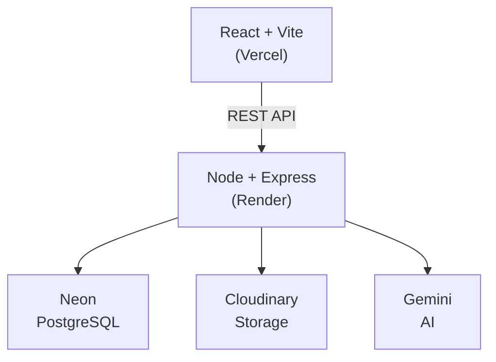
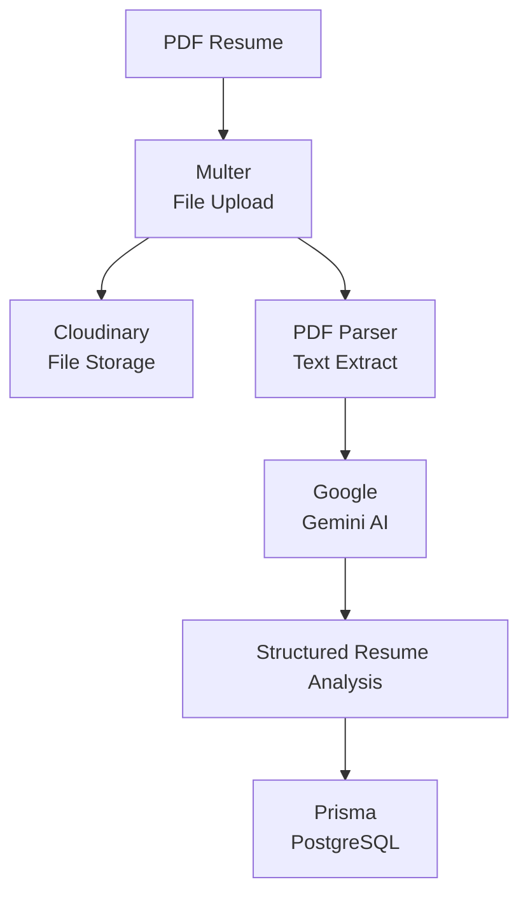
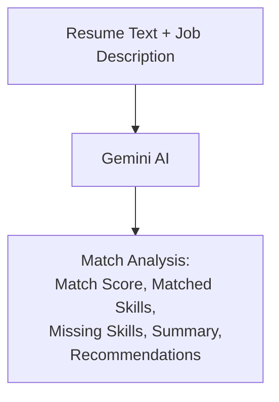

# 🚀 AI Resume Analyzer

> An AI-powered resume analysis and job matching platform that helps candidates understand their resume quality, identify skill gaps, and tailor their applications to specific job descriptions.

🌐 **Live Demo:** https://ai-resume-analyzer-gu2l84hqz.vercel.app/

📦 **GitHub:** https://github.com/Sumit-63030/AI-Resume-Analyzer

---

## 🏗️ Architecture



## ✨ Features

### 📄 AI Resume Analysis
Upload a PDF resume and receive an AI-generated analysis including:
- 📊 ATS score from 0–100
- 💪 Resume strengths
- ⚠️ Resume weaknesses
- 🧩 Missing or recommended skills
- 💡 Actionable improvement suggestions

### 🎯 Job Description Matching
Compare your resume against a specific job description and receive:
- 🎯 Match score from 0–100
- ✅ Matched skills
- ❌ Missing skills
- 📝 Match summary
- 💡 Personalized improvement recommendations

### 🔐 Authentication
- User registration and login
- JWT-based authentication
- Password hashing with bcrypt
- Protected frontend routes
- Protected backend API routes

### 📚 Resume History
Users can:
- View previously analyzed resumes
- Revisit previous AI analyses
- View ATS scores
- Delete saved analyses

### ☁️ Cloud File Storage
Uploaded resumes are securely stored using Cloudinary instead of being stored directly on the application server.

---

## 🧠 How It Works

### Resume Analysis Pipeline



### Job Matching Pipeline



---

## 🛠️ Tech Stack

### Frontend
- React 19
- Vite
- React Router
- Axios
- React Hot Toast
- Lucide React

### Backend
- Node.js
- Express 5
- Prisma ORM
- PostgreSQL
- JSON Web Tokens
- bcrypt
- Multer
- pdf-parse
- Google Gemini API
- Cloudinary

### Production Infrastructure

| Service | Purpose |
|---|---|
| Vercel | React frontend hosting |
| Render | Express backend hosting |
| Neon | Hosted PostgreSQL database |
| Cloudinary | Resume file storage |
| Google Gemini | AI resume & job matching |

---

## 📂 Project Structure

```
AI-Resume-Analyzer/
│
├── client/
│   ├── src/
│   │   ├── components/
│   │   │   ├── AnalysisCard.jsx
│   │   │   ├── JobMatchCard.jsx
│   │   │   ├── JobMatchResult.jsx
│   │   │   ├── Navbar.jsx
│   │   │   ├── ResumeList.jsx
│   │   │   └── UploadCard.jsx
│   │   │
│   │   ├── pages/
│   │   │   ├── Dashboard.jsx
│   │   │   ├── Login.jsx
│   │   │   └── Register.jsx
│   │   │
│   │   ├── services/
│   │   │   └── api.js
│   │   │
│   │   └── styles/
│   │
│   ├── .env
│   ├── package.json
│   └── vercel.json
│
├── server/
│   ├── controllers/
│   │   ├── authController.js
│   │   ├── jobMatchController.js
│   │   ├── resumeController.js
│   │   └── userController.js
│   │
│   ├── routes/
│   │   ├── authRoutes.js
│   │   ├── jobMatchRoutes.js
│   │   ├── resumeRoutes.js
│   │   └── userRoutes.js
│   │
│   ├── middleware/
│   │   ├── authMiddleware.js
│   │   └── uploadMiddleware.js
│   │
│   ├── services/
│   │   └── aiService.js
│   │
│   ├── utils/
│   │   └── pdfParser.js
│   │
│   ├── lib/
│   │   ├── cloudinary.js
│   │   └── prisma.js
│   │
│   ├── prisma/
│   │   ├── schema.prisma
│   │   └── migrations/
│   │
│   ├── server.js
│   └── package.json
│
└── README.md
```

---

## ⚙️ Getting Started

### Prerequisites

Make sure you have:
- Node.js 18+
- PostgreSQL
- Git
- Google Gemini API key
- Cloudinary account

### 1. Clone the Repository

```bash
git clone https://github.com/Sumit-63030/AI-Resume-Analyzer.git
cd AI-Resume-Analyzer
```

### 2. Backend Setup

```bash
cd server
npm install
```

Create a `.env` file inside `server/`:

```env
PORT=5500
DATABASE_URL=your_postgresql_connection_string
JWT_SECRET=your_jwt_secret
GEMINI_API_KEY=your_gemini_api_key
CLOUDINARY_CLOUD_NAME=your_cloudinary_cloud_name
CLOUDINARY_API_KEY=your_cloudinary_api_key
CLOUDINARY_API_SECRET=your_cloudinary_api_secret
```

Run Prisma migrations:

```bash
npx prisma migrate dev
```

Start the backend:

```bash
npm run dev
```

The backend will run at:
```
http://localhost:5500
```

### 3. Frontend Setup

Open another terminal:

```bash
cd client
npm install
```

Create a `.env` file inside `client/`:

```env
VITE_API_URL=http://localhost:5500/api
```

Start the frontend:

```bash
npm run dev
```

The frontend will run at:
```
http://localhost:5173
```

---

## 🔑 Environment Variables

### Server

| Variable | Description |
|---|---|
| `DATABASE_URL` | PostgreSQL connection string |
| `JWT_SECRET` | Secret used to sign JWTs |
| `GEMINI_API_KEY` | Google Gemini API key |
| `CLOUDINARY_CLOUD_NAME` | Cloudinary cloud name |
| `CLOUDINARY_API_KEY` | Cloudinary API key |
| `CLOUDINARY_API_SECRET` | Cloudinary API secret |
| `PORT` | Backend port |

### Client

| Variable | Description |
|---|---|
| `VITE_API_URL` | Backend API base URL |

⚠️ Never commit `.env` files or API secrets to GitHub.

---

## 📡 API Overview

| Method | Endpoint | Description | Auth Required |
|---|---|---|---|
| POST | `/api/auth/register` | Register a new user | No |
| POST | `/api/auth/login` | Log in and receive a JWT | No |
| GET | `/api/users/me` | Get the logged-in user's profile | Yes |
| POST | `/api/resume/upload` | Upload a resume PDF and get analysis | Yes |
| GET | `/api/resume` | List the user's uploaded resumes | Yes |
| GET | `/api/resume/:id` | Get a specific resume's details | Yes |
| DELETE | `/api/resume/:id` | Delete a resume | Yes |
| POST | `/api/job-match` | Compare the latest resume to a job description | Yes |

Protected endpoints require:
```
Authorization: Bearer <JWT>
```

---

## 🗄️ Database

The application uses PostgreSQL with Prisma ORM.

### Main Models

**User**
- User ID
- Name
- Email
- Hashed password
- Account creation date

**Resume**
- Resume ID
- Original filename
- Cloudinary URL
- Extracted resume text
- ATS score
- AI-generated analysis
- User relationship
- Creation date

Prisma migrations are version-controlled inside `server/prisma/migrations/`.

---

## 🚀 Deployment

The application is deployed using:

- **Frontend:** Vercel
- **Backend:** Render
- **Database:** Neon PostgreSQL
- **File Storage:** Cloudinary
- **AI:** Google Gemini

### Live Demo

https://ai-resume-analyzer-gu2l84hqz.vercel.app/

---

## 📸 Screenshots

Screenshots can be added here to showcase the application.

- **Login** — Add screenshot here
- **Dashboard** — Add screenshot here
- **Resume Analysis** — Add screenshot here
- **Job Matching** — Add screenshot here

---

## 🔮 Future Improvements

Some potential improvements for future versions:
- 📄 Resume templates
- 🎨 AI-powered resume rewriting
- 📊 More detailed ATS breakdowns
- 💼 Job board integration
- 📈 Resume score tracking over time
- 🤖 More personalized AI recommendations
- 📥 Export analyzed results as PDF
- 🔗 Custom resume sharing links

---

## 🔐 Security

The application implements several security practices:
- Password hashing with bcrypt
- JWT-based authentication
- Protected API endpoints
- User-specific resume access
- Environment variables for secrets
- `.env` files excluded from version control

---

## 👨‍💻 Author

**Sumit Mahesh Dharmadhikari**

📦 GitHub: https://github.com/Sumit-63030
🌐 Project: https://ai-resume-analyzer-gu2l84hqz.vercel.app/

---

## ⭐ Support

If you found this project interesting, consider giving the repository a ⭐ on GitHub!
